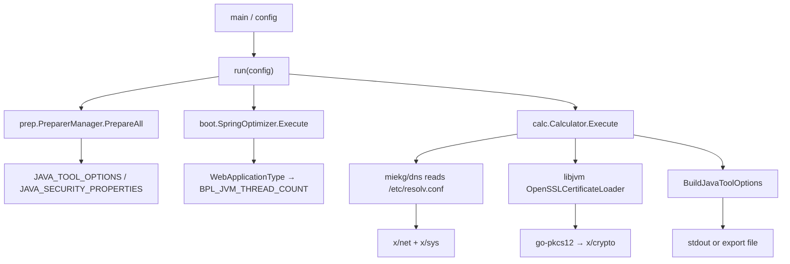

# Implementation Plan: Issue #67 Go 套件風險修正

## Status

- 狀態：原始碼驗收完成；發布驗收尚未完成。
- 規格來源：[`SPEC.md`](../SPEC.md)
- 任務清單：[`todo.md`](todo.md)

## Overview

先在現行依賴上鎖定 production-path 契約，再升級核准的最小 module closure 並完成原始碼驗收。發布驗收仍以 GitHub Release `1.2.6`、binary build info 與下游 Harbor 回填為必要閘門；PR／Issue 的即時狀態以 GitHub 為準。

## Component Dependency Graph

執行順序：`T1 → T2 → T3 → Checkpoint A → T4 → Checkpoint B → T5 → Checkpoint C → T6 → Checkpoint D → T7 → Checkpoint E`。

## Implementation Constraints

- Scope、完成條件與操作邊界以 [`SPEC.md`](../SPEC.md) 為準。
- 整合測試使用 child process 隔離 `prep`／`boot`／`calc` 的 process-wide environment。
- 已確認官方 `libjvm v1.46.0` tag（commit `d0895b1355131c76a1ef2d998ea1cfcda19c1cce`）：[`LinkLocalDNS`](https://github.com/paketo-buildpacks/libjvm/blob/v1.46.0/helper/link_local_dns.go) 不改寫 `JAVA_TOOL_OPTIONS`。
- [`OpenSSLCertificateLoader`](https://github.com/paketo-buildpacks/libjvm/blob/v1.46.0/helper/openssl_certificate_loader.go) 可由暫存 `BPI_JVM_CACERTS`、`SSL_CERT_FILE`、`SSL_CERT_DIR` 完全控制測試輸入。

## Harbor Remediation Baseline

固定自 [issue #67](https://github.com/softleader/memory-calculator/issues/67) 於 2026-07-14 的內容；Task 7 對此快照比對，不依賴日後可能變動的 issue 文字。

- `x/crypto`：`CVE-2026-39827`、`CVE-2026-39828`、`CVE-2026-39829`、`CVE-2026-39830`、`CVE-2026-39831`、`CVE-2026-39832`、`CVE-2026-39833`、`CVE-2026-39834`、`CVE-2026-39835`、`CVE-2026-42508`、`CVE-2026-46595`、`CVE-2026-46597`、`CVE-2026-46598`。
- `x/net`：`CVE-2026-25680`、`CVE-2026-25681`、`CVE-2026-27136`、`CVE-2026-33814`、`CVE-2026-39821`、`CVE-2026-42502`、`CVE-2026-42506`。
- `x/sys`：`CVE-2026-39824`。
- 殘餘風險：`GO-2026-5932` 無修復版本，不列入上述 21 個應消失的 CVE。

## Phase 1: Lock Production Contracts

### Task 1: 啟用 Spring WebApplicationType 契約

**Description:** 讓現有 None、Reactive、Servlet 與 error specs 被 Go test runner 執行，並還原 package-level resolver override。

**Acceptance criteria:**

- [x] 頂層 `TestWebApplicationType` 透過既有 `spec.Run` 執行四個情境。
- [x] production logic 不變，測試後 `ResolveWebAppType` 已還原。

**Verification:**

- [x] `GOTOOLCHAIN=go1.25.9 go test -count=1 -run '^TestWebApplicationType$' ./boot/helper`

**Dependencies:** None

**Files likely touched:** `boot/helper/web_application_type_test.go`

**Estimated scope:** XS — 1 file

### Task 2: 建立完整編排與 Linux canonical 契約

**Description:** 以 child process、production `NewPreparerManager` 與 production Cobra `newCommand`／`SetArgs` 走完 `prep → boot → calc → out`；通用案例經 `--loaded-class-count` 驗證輸出與優先語意，Linux 案例同時讀取 `/etc/resolv.conf` 並固定完整 JVM options 字串。

**Acceptance criteria:**

- [x] 暫存 `JAVA_HOME`、application paths、security properties、memory limit 與 loaded-class-count 完全隔離。
- [x] 通用案例透過 production Cobra `newCommand`／`SetArgs` 的 `--loaded-class-count` 路徑斷言 export 格式、必要 options、唯一性與優先順序。
- [x] Linux amd64 案例無 resolver error，並斷言完整、順序固定的 `JAVA_TOOL_OPTIONS`。

**Verification:**

- [x] `GOTOOLCHAIN=go1.25.9 go test -count=1 -run '^TestRun_' .`
- [x] Linux amd64：`GOTOOLCHAIN=go1.25.9 go test -count=1 -run '^TestRun_LinuxResolverContract$' .`

**Dependencies:** Task 1

**Files likely touched:** `main_integration_test.go`、`main_integration_linux_test.go`

**Estimated scope:** M — 2 files

### Task 3: 建立憑證載入契約

**Description:** 在 child process 中以 test-only PKCS#12 truststore 與 PEM certificate 執行公開 `Calculator.Execute` 路徑。

**Acceptance criteria:**

- [x] loader 成功，且可寫的暫存 truststore digest 在執行後改變。
- [x] fixtures 只含公開憑證與 `libjvm v1.46.0` 要求的 passwordless PKCS#12，不讀 host CA store 或加入 direct test dependency。

**Verification:**

- [x] `GOTOOLCHAIN=go1.25.9 go test -count=1 -run '^TestCalculator_Execute_CertificateLoaderContract$' ./calc`
- [x] `openssl pkcs12 -info` 與 PEM 內容確認 fixtures 不含 private key 或正式秘密。

**Dependencies:** Task 2

**Files likely touched:** `calc/calculator_integration_test.go`、兩個 `calc/testdata/` fixtures、`calc/testdata/README.md`

**Estimated scope:** M — 4 files

## Checkpoint A: Contracts Before Upgrade

- [x] Tasks 1–3 在現行依賴上通過；Linux test 已實際執行，不以 cross-compile 取代。
- [x] 既有 74 tests 未移除或弱化。
- [x] 未新增 production seam、workflow 修改或 dependency。

## Phase 2: Upgrade and Verify

### Task 4: 升級 module closure 並完成原始碼驗收

**Description:** 先執行升級前 baseline，再更新核准 module closure；完成全部驗證後 stage 精確檔案，保存 `git write-tree` 作為唯一已驗證 tree。

**Acceptance criteria:**

- [x] 已比對升級前後的 module graph、raw／normalized `govulncheck v1.6.0` 與 exit status。
- [x] versions 為 `x/crypto v0.52.0`、`x/net v0.55.0`、`x/sys v0.45.0`、`x/mod v0.35.0`、`x/sync v0.20.0`、`x/text v0.37.0`、`x/tools v0.44.0`；Go/toolchain 與無關 dependencies 不變。
- [x] tests、race、vet、coverage ≥ `53.3%`、四平台 builds 全部通過，且沒有新增 symbol-level finding。
- [x] 完整驗證後才 stage；`VERIFIED_TREE=$(git write-tree)` 保存於 repo 外，不再修改 staged tree。

**Verification:**

- [x] 執行 `SPEC.md` 的 Baseline、Coverage、Build Matrix 與 Vulnerability Verification 命令。
- [x] 執行 pinned `go get`、`go mod tidy -diff`、`go list -m all` 與 filtered `go mod graph`。
- [x] `gofmt -l .` 無輸出，`git diff --check` 通過。

**Dependencies:** Tasks 1–3、Checkpoint A

**Files likely touched:** `go.mod`、`go.sum`

**Estimated scope:** M — 2 files plus verification matrix

## Checkpoint B: Commit Authorization

- [x] Human 已審查 module diff、驗證結果與 `$VERIFIED_TREE`。
- [x] Human 明確授權 commit、push 與 PR。

## Phase 3: Publish and Accept

### Task 5: 建立 PR 並完成合併前驗證／處理 review feedback

**Description:** 將已驗證 staged tree 原樣 commit；tree identity 相同才 push、建立 PR，完成合併前 CI／human review 驗證並收斂 review feedback。合併是 release gate 的前置條件，不在本任務中假定為已發生的即時狀態。

**Acceptance criteria:**

- [x] commit 前 invoke `engineering:git-commit-co-author` skill。
- [x] `git rev-parse 'HEAD^{tree}'` 等於 `$VERIFIED_TREE`；不同即停止並重新驗證。
- [x] PR #68 已建立，PR title 通過 Conventional Commits check，合併前 CI／human review 驗證與 review feedback 收斂已完成。

**Verification:**

- [x] `echo "$PR_TITLE" | npx --yes -p @commitlint/cli -p @commitlint/config-conventional commitlint --extends @commitlint/config-conventional`
- [x] `gh pr checks <PR>` 合併前驗證時全部通過。

**Dependencies:** Task 4、Checkpoint B、明確授權

**Files likely touched:** None beyond the verified staged tree

**Estimated scope:** S — delivery operation

## Checkpoint C: Release Authorization

發布驗收的外部即時狀態以 GitHub 的 PR #68／Issue #67 為準；下列項目是建立 release 前必須重新確認的 durable gate。

- [ ] PR 已合併；PR head 與 merge commit 的 tree hash 相同，不同即停止發布並重新驗收候選版本。
- [ ] `1.2.6` 尚未存在，且 Human 明確授權建立 GitHub Release。

### Task 6: 建立並驗證 GitHub Release 1.2.6

**Description:** 從核准 merge commit 建立 `1.2.6`，等待既有 GoReleaser workflow 產出並驗證 artifacts。

**Acceptance criteria:**

- [ ] 四個 platform archives 與 `checksums.txt` 齊全且 checksum 正確。
- [ ] 四個 binary 的 `go version -m` 已記錄；`--version`／`--platform` 只在有相符 host 時補驗，非 release gate。

**Verification:**

- [ ] `gh release view 1.2.6` 指向核准 commit 且 assets 完整。
- [ ] 下載 assets，驗證 checksum 與四個 binary build info。

**Dependencies:** Task 5、Checkpoint C

**Files likely touched:** None in repo; GitHub Release and issue evidence are external state

**Estimated scope:** M — asynchronous release workflow

## Checkpoint D: Downstream Handoff

- [ ] `1.2.6` artifact evidence 齊全；下游取得固定版本、checksum 與殘餘風險說明。
- [ ] 本 repo 不直接操作 Harbor。

### Task 7: 收斂下游 Harbor 驗收

**Description:** 下游以 `1.2.6` 重建映像、重掃並回填；repo 維護者對固定 21-CVE baseline 驗收。

**Acceptance criteria:**

- [ ] 回填包含 resolved module versions、image tag／digest、掃描時間、scanner version、report identity 與結果。
- [ ] 固定的 21 個 CVE 不再出現；`GO-2026-5932` 如仍出現則標記為無修復殘餘風險。

**Verification:**

- [ ] 映像可追溯到 `1.2.6`，不是 `latest`、`main` 或未標記 commit。

**Dependencies:** Task 6、下游維護者可配合回填

**Files likely touched:** None in repo; Harbor and issue #67 are external state

**Estimated scope:** S for repo maintainer

## Checkpoint E: Complete

- [ ] `SPEC.md` 的 release 與下游 Harbor Success Criteria 全部具備證據。
- [ ] Release commit → binary → downstream image digest 可追溯。
- [ ] 依 `CONTEXT.md` 定義宣告「Issue #67 範圍完成」。
